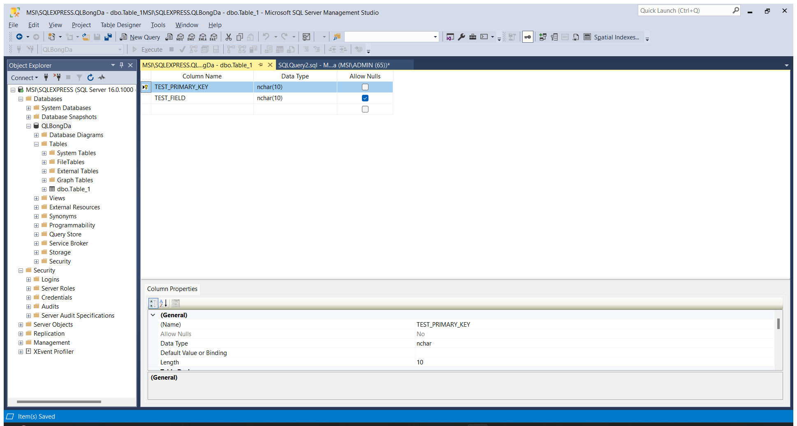

Mục lục
- [Bài thực hành số 1](#bài-thực-hành-số-1)
  - [Cài đặt SQL Server](#cài-đặt-sql-server)
  - [Thao tác cơ bản](#thao-tác-cơ-bản)
- [Bài thực hành số 2](#bài-thực-hành-số-2)
- [Bài thực hành số 3](#bài-thực-hành-số-3)
- [Bài thực hành số 4](#bài-thực-hành-số-4)
- [Bài thực hành số 5](#bài-thực-hành-số-5)

> Các bạn lưu ý đọc hướng dẫn trong các file pdf nhé.

# Bài thực hành số 1

## Cài đặt SQL Server

Tải SQL Server 2022 bản Express (thay cho 2015): <https://www.microsoft.com/en-us/sql-server/sql-server-2022>

Chọn Basic và cài đặt
- 

Chọn Install SSMS (hoặc <https://learn.microsoft.com/en-us/sql/ssms/download-sql-server-management-studio-ssms?view=sql-server-ver16&redirectedfrom=MSDN>) và tải SSMS, sau đó cài đặt. Chọn Close ở cửa sổ cài đặt SQL Server trên.
- 

## Thao tác cơ bản

Có thể tạo bảng như ảnh sau, nhớ chọn Set primary key để đặt cột đó làm khóa chính (sau khi Save thử kiểm tra lại xem bảng đã có trong database chưa):
- 

Có thể Execute thử query sau để liệt kê các bảng trong database `QLBongDa`:
```sql
SELECT TABLE_NAME
FROM QLBongDa.INFORMATION_SCHEMA.TABLES
WHERE TABLE_TYPE = 'BASE TABLE'
```
- 

# Bài thực hành số 2

# Bài thực hành số 3

# Bài thực hành số 4

# Bài thực hành số 5


--------

Tham khảo
-  <https://stackoverflow.com/questions/175415/how-do-i-get-list-of-all-tables-in-a-database-using-tsql>